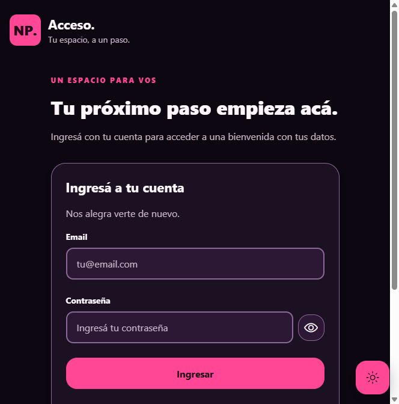
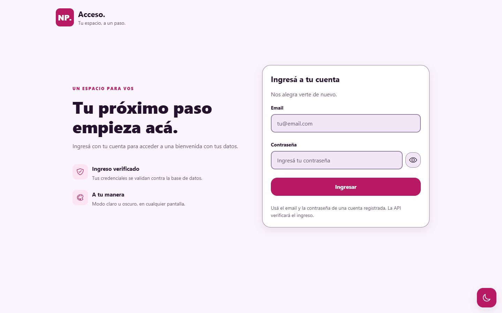

# Acceso de usuarios · NP

Proyecto académico independiente: React Native + Expo + TypeScript, con API Node.js
y base MySQL/MariaDB local mediante XAMPP, WAMP o LAMP.

> Estado: **seis partes documentadas y cierre operativo en curso**, frontend 0.5.2.
> Backend 0.3.0; XAMPP habitual configurado, login y bienvenida con props comprobados.
> GitHub publicado en main/develop. Pendientes: confirmar pruebas nativas y completar hosting.
> Los proyectos 1 y 2 no se modifican.

## Documentación de entrega

Estado actualizado después de las seis partes en
[docs/operations.md](docs/operations.md); revisión de dependencias en
[docs/security.md](docs/security.md).

| Guía                              | Contenido                                              |
| --------------------------------- | ------------------------------------------------------ |
| [Entrega final](docs/delivery.md) | Estado, capturas, verificación y pendientes.           |
| [Rúbrica](docs/rubric.md)         | Cada requisito marcado con evidencia real.             |
| [Pruebas](docs/testing.md)        | Casos manuales, esperados y resultados por plataforma. |
| [Componentes](docs/components.md) | Atomic Design, props, hooks y responsabilidades.       |
| [Git](docs/git-guide.md)          | Commits convencionales, ramas, SemVer y publicación.   |
| [Defensa oral](docs/defense.md)   | Recorrido del código y preguntas/respuestas.           |

### Capturas reales

Todas son **web**; el tamaño móvil no significa ejecución nativa.
La bienvenida usa datos ficticios del seed devueltos por Express/SQL.





[Bienvenida móvil](docs/screenshots/bienvenida-movil.png) ·
[Bienvenida escritorio](docs/screenshots/bienvenida-escritorio-claro.png) ·
[Spinner](docs/screenshots/login-cargando.png) ·
[Timeout](docs/screenshots/login-timeout.png)

[Bienvenida con XAMPP habitual](docs/screenshots/bienvenida-xampp-real.png).

## Versiones y decisiones

- Expo **57.0.26** y Expo Router **57.0.24**, resueltos por el canal estable
  de npm al preparar este proyecto el 5 de octubre de 2026.
- React Native **0.86.3**, React **19.2.3** y TypeScript **6.0.3**.
- Node **24 LTS** recomendado; entorno comprobado: Node **24.15.0**, npm **11.12.1**.
- Express **5**, mysql2 y bcrypt; versiones resueltas en los dos package-lock.json.
- ESLint **10**, Prettier **3** y typescript-eslint **8**.
- Configuración ESLint propia con reglas de TypeScript y React Hooks: evita forzar
  ESLint 10 sobre plugins antiguos de eslint-config-expo que solo aceptan ESLint 9.
- Rutas en **app/**, no en src/app/, para respetar la estructura solicitada.
- JSON no admite comentarios: el propósito de sus configuraciones se documenta aquí.
- React Native usa assets/ y StyleSheet en lugar de public/ y hojas CSS de Vite.
- Se mantiene la identidad violeta oscuro y rosa/fucsia de los proyectos anteriores.

**Props y navegación:** welcome.tsx valida el usuario del estado compartido y lo pasa
como props tipadas a WelcomePage; no se duplican datos personales en la URL.
Nunca viajan contraseñas ni hashes a la bienvenida.

XAMPP distribuye **MariaDB**, compatible con el protocolo MySQL usado por mysql2.
El SQL se diseñó para MariaDB 10.4+ y MySQL 8.0.16+; CHECK debe estar realmente
soportado, no solo aceptado sintácticamente.
Se ejecutó MariaDB 10.4.32; no se comprobó MySQL 8 por separado.

## Plan por etapas

- [x] Parte 1: plantilla TypeScript, dependencias, estructura, configuraciones y entorno.
- [x] Parte 2: normalización 1FN/2FN/3FN, diagrama ER, schema.sql, seed.sql y consultas.
- [x] Parte 3: validación del login, consultas parametrizadas, bcrypt, logs y seguridad.
- [x] Parte 4: estilos, tipos, contexts, hooks, servicios y componentes Atomic Design.
- [x] Parte 5: formulario, navegación, bienvenida mediante props y layouts responsive.
- [x] Parte 6: documentación, guía Git, rúbrica, plan de pruebas y defensa oral.
- [x] Entrega documental: capturas web reales y exclusión de archivos privados.
- [x] Entrega operativa local: XAMPP habitual y cuenta limitada configurados.
- [x] Código publicado en GitHub con main/develop, sin secretos locales.
- [x] Reproducción desde clone limpio: instalación, verificaciones, exportación y API.
- [ ] Entrega restante: confirmar dispositivos y hosting.

La instalación de una dependencia no significa que su funcionalidad ya esté implementada.
Las guías de las partes previas conservan el estado histórico de cada etapa.

## Árbol real al cerrar la Parte 6

Se omiten .git/, node_modules/, .expo/ y dist/.

```text
proyecto-3-acceso-usuarios/
├── app/
│   ├── _layout.tsx
│   ├── index.tsx
│   └── welcome.tsx
├── src/
│   ├── components/
│   │   ├── atoms/
│   │   │   ├── AppText.tsx
│   │   │   ├── Button.tsx
│   │   │   ├── Card.tsx
│   │   │   ├── EntranceView.tsx
│   │   │   ├── IconButton.tsx
│   │   │   ├── Input.tsx
│   │   │   ├── ScrollToTopButton.tsx
│   │   │   └── ThemeToggleButton.tsx
│   │   ├── molecules/
│   │   │   ├── BrandHeader.tsx
│   │   │   ├── InfoRow.tsx
│   │   │   ├── TextField.tsx
│   │   │   └── UserDetailRow.tsx
│   │   └── organisms/
│   │       ├── LoginForm.tsx
│   │       └── ScreenShell.tsx
│   ├── pages/
│   │   ├── LoginPage.tsx
│   │   └── WelcomePage.tsx
│   ├── services/
│   │   ├── apiConfig.ts
│   │   └── authService.ts
│   ├── hooks/
│   │   ├── useAuth.ts
│   │   ├── useBreakpoint.ts
│   │   ├── useKeyboardVisible.ts
│   │   ├── useLoginForm.ts
│   │   ├── useReducedMotion.ts
│   │   ├── useScrollToTop.ts
│   │   └── useTheme.ts
│   ├── context/
│   │   ├── AuthContext.tsx
│   │   └── ThemeContext.tsx
│   ├── utils/
│   │   ├── ApiError.ts
│   │   ├── responseGuards.ts
│   │   ├── userPresentation.ts
│   │   └── validation.ts
│   ├── styles/
│   │   ├── breakpoints.ts
│   │   ├── colors.ts
│   │   ├── shadows.ts
│   │   ├── spacing.ts
│   │   ├── theme.ts
│   │   └── typography.ts
│   ├── constants/
│   │   ├── app.ts
│   │   └── messages.ts
│   └── types/
│       ├── auth.ts
│       └── theme.ts
├── assets/
│   ├── android-icon-background.png
│   ├── android-icon-foreground.png
│   ├── android-icon-monochrome.png
│   ├── favicon.png
│   ├── icon.png
│   └── splash-icon.png
├── backend/
│   ├── controllers/
│   │   ├── authController.ts
│   │   └── healthController.ts
│   ├── models/
│   │   └── userModel.ts
│   ├── routes/
│   │   ├── authRoutes.ts
│   │   └── healthRoutes.ts
│   ├── middlewares/
│   │   ├── corsMiddleware.ts
│   │   ├── errorHandler.ts
│   │   ├── loginRateLimiter.ts
│   │   └── validateLogin.ts
│   ├── config/
│   │   ├── database.ts
│   │   ├── environment.ts
│   │   └── password.ts
│   ├── constants/
│   │   └── auth.ts
│   ├── types/
│   │   └── auth.ts
│   ├── utils/
│   │   ├── HttpError.ts
│   │   └── validation.ts
│   ├── examples/
│   │   ├── login-request.json
│   │   ├── incorrect-password.json
│   │   └── empty-fields.json
│   ├── database/
│   │   ├── schema.sql
│   │   ├── seed.sql
│   │   ├── create_app_user.sql
│   │   └── queries.sql
│   ├── app.ts
│   ├── server.ts
│   ├── .env
│   ├── .env.example
│   ├── package.json
│   ├── package-lock.json
│   ├── tsconfig.json
│   ├── eslint.config.js
│   ├── .prettierrc.json
│   └── .prettierignore
├── docs/
│   ├── database.md
│   ├── backend.md
│   ├── frontend-base.md
│   ├── screens.md
│   ├── components.md
│   ├── git-guide.md
│   ├── rubric.md
│   ├── testing.md
│   ├── defense.md
│   ├── delivery.md
│   ├── operations.md
│   ├── security.md
│   └── screenshots/
│       ├── login-final-oscuro.png
│       ├── login-escritorio-claro.png
│       ├── bienvenida-movil.png
│       ├── bienvenida-escritorio-claro.png
│       ├── bienvenida-xampp-real.png
│       ├── login-cargando.png
│       └── login-timeout.png
├── .env
├── .env.example
├── .gitignore
├── .gitattributes
├── .prettierrc.json
├── .prettierignore
├── app.json
├── eslint.config.js
├── tsconfig.json
├── package.json
├── package-lock.json
├── LICENSE
├── README.md
└── CHANGELOG.md
```

welcome.tsx valida el usuario en memoria y entrega props a WelcomePage; sin usuario
redirige al login. LoginForm y las dos vistas completas ya están conectados.

## Requisitos y XAMPP en Windows

1. Node 24 LTS, npm, Git y Expo Go actualizado en el celular.
2. XAMPP: descargar de [Apache Friends](https://www.apachefriends.org/download.html)
   si no está instalado. En esta computadora se detectó C:\xampp y MariaDB 10.4.32:
   **no hace falta reinstalarlo**.
3. Abrir C:\xampp\xampp-control.exe. Iniciar **MySQL**. Iniciar **Apache**
   únicamente si vas a usar phpMyAdmin; Express se ejecuta por separado con Node.
4. Abrir [phpMyAdmin local](http://localhost/phpmyadmin/) y comprobar la conexión.
5. Usar Importar, primero backend/database/schema.sql y después seed.sql, una sola vez.
6. Crear el usuario de aplicación siguiendo docs/database.md, con contraseña privada.
   El backend nunca
   debe conectarse como root; la cuenta administrativa solo importa el SQL.
7. MySQL/MariaDB se queda local. No abrir el puerto 3306 ni phpMyAdmin a Internet.

En WAMP/LAMP cambian el panel y las rutas de instalación; la API mantiene el mismo
protocolo y configura DB_HOST, DB_PORT, DB_USER y DB_PASSWORD en backend/.env.

## Instalación del proyecto ya creado

Ejecutar en PowerShell:

```powershell
Set-Location "C:\Users\parro\OneDrive\Desktop\react-native-tps\proyecto-3-acceso-usuarios"
npm ci
npm --prefix backend ci
```

Ambos lockfiles se versionan. No ejecutar create-expo-app otra vez sobre esta carpeta.

### Cómo reproducir la creación desde cero

Este bloque es explicativo: usar otra carpeta que todavía no exista. La plantilla
blank-typescript fija el SDK estable y luego se añade Expo Router:

```powershell
Set-Location "C:\Users\parro\OneDrive\Desktop\react-native-tps"
npx create-expo-app@5.0.0 proyecto-3-acceso-usuarios --template expo-template-blank-typescript@57.0.28 --no-install --no-agents-md --yes
Set-Location ".\proyecto-3-acceso-usuarios"
npm install
npx expo install expo-router react-native-safe-area-context react-native-screens expo-linking expo-constants expo-status-bar expo-font expo-system-ui @expo/vector-icons @react-native-async-storage/async-storage react-native-web react-dom react-native-gesture-handler react-native-reanimated react-native-worklets
npx expo install --dev eslint@^10.12.0 @eslint/js@^10.0.1 typescript-eslint@^8.71.1 eslint-plugin-react-hooks@^7.1.1 globals@^17.0.0 prettier eslint-config-prettier
```

Para reproducir exactamente nuestro setup hay que aplicar también los archivos
de configuración de esta carpeta: main usa expo-router/entry, se quitan los
archivos iniciales App.tsx e index.ts y se crean app/ y src/.
El generador normalmente hace un commit automático; en esta ejecución se evitó
esa operación y se inicializó después el repositorio sin commits.

Dentro de backend/, las dependencias que ya están instaladas equivalen a:

```powershell
npm install express@^5 mysql2 bcrypt cors helmet express-rate-limit dotenv
npm install --save-dev typescript@~6.0.3 tsx @types/node@^24 @types/express@^5 @types/bcrypt @types/cors eslint@^10 @eslint/js@^10 typescript-eslint globals prettier eslint-config-prettier
```

### Para qué se usa cada dependencia extra

| Dependencia                                        | Responsabilidad                                                      |
| -------------------------------------------------- | -------------------------------------------------------------------- |
| Expo Router                                        | Rutas y navegación; sus archivos no son las vistas de pages/.        |
| safe-area-context / screens                        | Safe areas modernas e integración de pantallas nativas.              |
| expo-linking / constants                           | Enlaces y configuración requeridos por Router.                       |
| expo-status-bar / system-ui                        | Integración de la interfaz con el sistema.                           |
| vector-icons / expo-font                           | Íconos y carga de sus fuentes; sin paquetes de diseño adicionales.   |
| AsyncStorage                                       | Persistir solo la preferencia de tema; no la contraseña.             |
| react-dom / react-native-web                       | Ejecutar la misma aplicación en navegador.                           |
| gesture-handler / reanimated / worklets            | Pares nativos compatibles de navegación y animación.                 |
| Express                                            | Servidor HTTP y rutas de la API.                                     |
| mysql2                                             | Pool MySQL/MariaDB y consultas parametrizadas.                       |
| bcrypt                                             | Crear hashes y comparar contraseñas, nunca cifrado reversible.       |
| cors / helmet / express-rate-limit                 | Orígenes permitidos, cabeceras y límite de intentos.                 |
| dotenv                                             | Leer variables privadas del backend sin introducirlas en el cliente. |
| tsx / TypeScript / @types                          | Desarrollo y compilación con tipos estrictos.                        |
| ESLint / typescript-eslint / react-hooks / globals | Revisar errores, tipos y reglas de hooks.                            |
| Prettier / eslint-config-prettier                  | Indentación de 2 espacios sin reglas de formato contradictorias.     |

La app usa fetch nativo: no agregamos Axios. Se usan Animated y useWindowDimensions
de React Native: no hace falta otra librería de responsive o animaciones.

## Base de datos — Parte 2

La explicación de 1FN/2FN/3FN, diagrama ER, diccionario, permisos, instrucciones
de importación y resultados de 38 comprobaciones están en [docs/database.md](docs/database.md).
Los SQL públicos están en backend/database/. Se validaron en MariaDB 10.4.32 aislada
y luego se importaron en la instancia habitual. Su password SQL quedó solo en el
archivo privado local; otras bases y cuentas no se modificaron.
No se guardaron accesos ficticios en el seed.

Credenciales **solo para desarrollo**, con hashes bcrypt de coste 12 en seed.sql:

| Email            | Contraseña de prueba | Rol     | Estado   |
| ---------------- | -------------------- | ------- | -------- |
| admin@np.test    | AdminDemo!2026       | admin   | Activo   |
| student@np.test  | StudentDemo!2026     | student | Activo   |
| inactive@np.test | InactiveDemo!2026    | student | Inactivo |

Estas cuentas no son usuarios de MySQL; la API rechaza la inactiva con el mismo
mensaje que un email inexistente o una contraseña incorrecta.

## API — Parte 3

Código completo, responsabilidades por archivo, contratos HTTP, ejemplos curl/Postman,
seguridad y 46 comprobaciones reales en [docs/backend.md](docs/backend.md).

- GET /api/health: 200, comprueba Express, no la conexión SQL.
- POST /api/auth/login: JSON con email/password; 200 con datos públicos, sin hash.
- Errores: 400 validación, 401 credenciales, 429 límite por IP y 500 fallo interno.
- También 403 CORS, 404 ruta desconocida, 405 método, 413 tamaño y 415 formato.
- Pool con cuenta restringida, UTC, SQL parametrizado y transacciones para logs.
- Helmet, CORS exacto, límite de 10 POST por IP cada 15 minutos y errores genéricos.
- Sin JWT ni sesión de servidor; no equivale a autorización de futuras rutas.

El formulario ya consume este endpoint con fetch, timeout y validación del JSON,
antes de navegar a una bienvenida con los datos públicos recibidos.

Ejemplo de request (credenciales ficticias del seed):

```json
{
  "email": "student@np.test",
  "password": "StudentDemo!2026"
}
```

Ejemplo de response HTTP 200; lastLoginAt varía con el evento SQL:

```json
{
  "success": true,
  "message": "Ingreso correcto.",
  "user": {
    "id": 2,
    "name": "Estudiante Demo",
    "email": "student@np.test",
    "role": "student",
    "lastLoginAt": "2026-10-05T12:00:00.000Z"
  }
}
```

HTTP 401 para inexistente, password incorrecto o cuenta inactiva:

```json
{ "success": false, "message": "Credenciales incorrectas" }
```

## Frontend base — Parte 4

Árbol, responsabilidades, props, hooks, diseño y pruebas en
[docs/frontend-base.md](docs/frontend-base.md).

- ThemeProvider lee el sistema por defecto y persiste solo el tema en AsyncStorage.
- AuthProvider conserva el usuario público en memoria, sin contraseñas ni tokens.
- Servicio POST con timeout de 10 segundos, cancelación y validación de respuesta.
- Validación cliente equivalente al backend: password de 8 caracteres/72 bytes UTF-8.
- Atomic Design: textos, inputs, acciones, tarjetas, TextField y ScreenShell.
- Tema flotante global abajo a la derecha; scroll encima, solo después del umbral.
- Responsive con useWindowDimensions, breakpoints, safe areas y contenido flexible.
- Sin dependencias extra de diseño; las bases ya se conectan a ambas pantallas.

## Pantallas conectadas — Parte 5

Flujo, contrato de props, responsabilidades y resultados en
[docs/screens.md](docs/screens.md).

- / muestra email/password con validación, foco, visibilidad y spinner.
- La API valida credenciales; AuthContext conserva solo el usuario público en memoria.
- LoginRoute redirige a /welcome, sin datos personales ni credenciales en la URL.
- WelcomeRoute valida el estado y renderiza WelcomePage con props tipadas.
- Bienvenida muestra nombre, email, rol, id y fecha del evento, con tema y scroll.
- Cerrar sesión limpia el estado y vuelve al login con inputs vacíos.
- Acceso directo sin usuario o recargar la bienvenida redirige al formulario.
- No hay JWT ni sesión persistente; estas props no autorizan endpoints futuros.

## Variables de entorno

El frontend tiene únicamente una URL pública. Los dos archivos locales .env están
configurados; el del frontend usa la IP de esta computadora y el del backend
el password privado de la cuenta SQL dedicada. Las plantillas públicas siguen
conteniendo placeholders, nunca el secreto real.
Revisar la IP cuando se cambie de red.

```dotenv
EXPO_PUBLIC_API_URL=http://192.168.1.2:3000
```

En una copia del repositorio:

```powershell
Copy-Item -LiteralPath ".env.example" -Destination ".env"
Copy-Item -LiteralPath "backend\.env.example" -Destination "backend\.env"
```

**No sobrescribir un .env configurado**. Editar backend/.env para reemplazar
DB_PASSWORD solo después de crear el usuario dedicado en la Parte 2.
Las credenciales del seed son del formulario, nunca la contraseña de la conexión SQL.

La plantilla del backend contiene:

```dotenv
NODE_ENV=development
HOST=0.0.0.0
PORT=3000
CORS_ORIGINS=http://localhost:8083,http://127.0.0.1:8083,http://192.168.1.2:8083
DB_HOST=127.0.0.1
DB_PORT=3306
DB_TIMEOUT_MS=5000
DB_NAME=np_user_access
DB_USER=np_login_app
DB_PASSWORD=REEMPLAZAR_POR_PASSWORD_LOCAL
LOGIN_RATE_LIMIT_WINDOW_MS=900000
LOGIN_RATE_LIMIT_MAX=10
BCRYPT_ROUNDS=12
```

EXPO_PUBLIC_* se incluye en el bundle y es visible al usuario: nunca poner ahí
contraseñas, hashes, claves privadas ni datos de MySQL.
La API valida su configuración al iniciar y rechaza root o una contraseña placeholder.
Una copia con el .env de ejemplo no debe arrancar hasta crear la cuenta SQL dedicada
y configurar su password privado. En esta PC ya se completó ese paso.

## Conexión local por plataforma

| Plataforma                          | EXPO_PUBLIC_API_URL                                 |
| ----------------------------------- | --------------------------------------------------- |
| Web en la PC                        | http://localhost:3000                               |
| Emulador Android de Android Studio  | http://10.0.2.2:3000                                |
| iPhone o Android físico con Expo Go | http://192.168.1.2:3000 o la IP LAN actual de tu PC |

localhost en el celular significa el propio celular, no la PC.
El emulador iOS oficial requiere macOS; Windows permite usar un iPhone físico con Expo Go.

Para averiguar la IP de Windows:

```powershell
ipconfig
```

En Linux/macOS usar ifconfig o ip addr si ifconfig no está instalado.
PC y celular deben estar en la misma red, sin aislamiento de clientes.
Si cambia la URL, hacer una recarga completa de Expo Go; en web recargar la página.

Si el firewall bloquea el acceso, abrir PowerShell **como administrador** y permitir
solo el puerto de la API en el perfil privado y desde la subred local:

```powershell
New-NetFirewallRule -DisplayName "NP Login API local 3000" -Direction Inbound -Action Allow -Protocol TCP -LocalPort 3000 -Profile Private -RemoteAddress LocalSubnet
```

Para retirar esa regla cuando deje de ser necesaria:

```powershell
Remove-NetFirewallRule -DisplayName "NP Login API local 3000"
```

Estas instrucciones **no se ejecutaron automáticamente**. No desactivar el firewall
ni exponer MySQL. El túnel de Expo comparte Metro, no la API Express de tu PC.
En CORS_ORIGINS se lista el origen del frontend web, no la URL del backend.
Expo Go no depende de CORS del navegador; las solicitudes sin Origin se admiten.

## Ejecución local

En una copia nueva, primero importar la base y configurar backend/.env.
En esta PC la base habitual y su cuenta ya están configuradas; iniciar MySQL.

Terminal 1, desde la raíz:

```powershell
npm --prefix backend run dev
```

Terminal 2, desde la raíz:

```powershell
npm start -- --lan --port 8083
```

Usamos 8083 para no ocupar los puertos 8081/8082 de los proyectos anteriores.
En el navegador abrir [frontend local](http://localhost:8083/).
En iPhone escanear el QR con Cámara y abrirlo con Expo Go.
Si Expo Go solicita autenticación, la cuenta del CLI y la del celular deben coincidir.

Comprobación del servidor, en otra terminal:

```powershell
Invoke-RestMethod -Uri "http://localhost:3000/api/health" -Method Get
```

Respuesta actual:

```json
{
  "success": true,
  "message": "Servidor disponible."
}
```

Este endpoint confirma que Node responde; no confirma MySQL.
Probar el login por HTTP, desde la raíz:

```powershell
curl.exe -i -H "Content-Type: application/json" --data-binary "@backend/examples/login-request.json" http://localhost:3000/api/auth/login
```

Los ejemplos adicionales y sus respuestas están en docs/backend.md.

## Comprobaciones y resultados

```powershell
npm run check
npm --prefix backend run check
npm --prefix backend run build
npx expo install --check
npx expo-doctor
npm run build:all
```

Resultado del setup del 5 de octubre de 2026:

- Lint, typecheck y formato: frontend y backend correctos.
- Backend compilado y GET /api/health responde HTTP 200 con JSON.
- Dependencias Expo compatibles; expo-doctor: 21/21 comprobaciones.
- Exportación web, Android e iOS completada.
- Pantalla provisional verificada en navegador.
- Auditoría: backend sin vulnerabilidades reportadas; frontend con 29 avisos de
  vulnerabilidades del árbol Expo/React Native (10 moderadas y 19 altas).
  No se aplicaron downgrades de SDK ni npm audit fix --force.
- En la Parte 1 todavía no se habían probado login ni base SQL.

Validación adicional de la Parte 3:

- 46 comprobaciones HTTP con backend compilado y MariaDB aislada: login correcto,
  credenciales incorrectas/inactivas, validaciones, Unicode, CORS y rate limiting.
- MySQL apagado y timeout real de handshake: 500 genérico; sin secretos en respuestas.
- Rechazo de root y password placeholder al iniciar; eventos en SQL y fecha UTC.
- Lint, typecheck, formato y compilación comprobados.
- Pendientes: base habitual de XAMPP, interfaz conectada, dispositivos reales y hosting.

Validación adicional de la Parte 4:

- 53 comprobaciones de utilidades/servicio con HTTP local: validación, Unicode, contrato
  JSON, contraste, errores HTTP, red, cancelación y timeout de 10 segundos.
- Tema claro/oscuro persistente al recargar web; vista móvil, tablet y escritorio.
- Scroll probado en viewport reducido; oculto cuando no corresponde.
- Lint, TypeScript, formato y exportación web/Android/iOS.
- En esa etapa los inputs reales y la navegación todavía no estaban conectados.

Validación adicional de la Parte 5:

- Login correcto de estudiante/administrador, bienvenida con props y datos SQL reales.
- Validaciones cliente, contraseña incorrecta, cuenta desconocida/inactiva y mostrar/ocultar.
- Enter/Next, spinner y bloqueo, logout, recarga y acceso directo sin usuario.
- Tema y scroll de ambas pantallas; móvil, tablet, orientación y escritorio web.
- BD aislada apagada, API desconectada y timeout controlado: mensajes y recuperación.
- 53 regresiones del servicio repetidas; lint, tipos, formato y exportaciones comprobados.
- Pendientes: configurar XAMPP habitual, teléfonos reales, revisión final y hosting.

Lint y typecheck no sustituyen una prueba en dispositivos. Exportar JavaScript
para Android/iOS tampoco significa que se haya ejecutado una app nativa.
No afirmar que la rúbrica completa está cumplida en esta etapa.

Validación final de la Parte 6, 5 de octubre de 2026:

- Checks de frontend/backend, compilación API y exportación web/Android/iOS correctos.
- Expo compatible; expo-doctor 21/21.
- 41 enlaces locales válidos en 12 Markdown; seis capturas web integradas.
- Versiones coherentes y código propio revisado: 62 archivos TypeScript sin any.
- Auditoría al cerrar la Parte 6: backend 0; frontend 29 avisos (10 moderados y 19 altos).
  No se aplicaron fixes forzados que puedan romper Expo.
- No se ejecutaron de nuevo los logins SQL en esta revisión documental:
  las pruebas de integración son las registradas en la Parte 5.
- XAMPP habitual, dispositivos reales, historial/remoto Git y hosting siguen pendientes.

## Git y versionado

Destino autorizado: [nehuenparrondo/rn1](https://github.com/nehuenparrondo/rn1).
El registro actualizado de publicación está en docs/operations.md.

Repositorio publicado en main/develop, con remoto origin y push verificado.
Los archivos .env privados quedan excluidos. La reproducción limpia y sus
resultados se registran en [docs/operations.md](docs/operations.md).

Guía paso a paso en [docs/git-guide.md](docs/git-guide.md); los comandos son
instrucciones para cuando decidas publicar, no operaciones ejecutadas.

Convenciones:

- main: versiones entregables; develop: integración; feature/*: cambios pequeños.
- feat:, fix:, docs:, refactor:, style: y chore: para commits descriptivos.
- SemVer: 0.1.0 setup, 0.2.0 SQL, 0.3.0 backend, 0.4.0 frontend base, 0.5.0 pantallas
  y 0.5.1 documentación, 0.5.2 revisión operativa y de dependencias;
  1.0.0 al verificar la entrega. El paquete backend conserva 0.3.0.
- Versionar package-lock.json y .env.example; nunca .env, node_modules/ ni dist/.
- Revisar git status y git diff --cached antes de publicar cualquier cambio.

El destino GitHub existe; no se creó ninguna etiqueta ni release.

## Cómo contribuir

1. Revisar [Git](docs/git-guide.md) y el alcance antes de agregar funciones.
2. Instalar con npm ci en ambos proyectos y crear solo configuraciones locales.
3. Hacer cambios pequeños en una feature/* después de crear el historial inicial.
4. Respetar nombres ingleses, comentarios españoles, TypeScript estricto y Atomic Design.
5. Ejecutar checks y repetir los casos afectados de [testing.md](docs/testing.md).
6. Actualizar CHANGELOG/documentación y revisar secretos antes de una pull request.

No usar contraseñas reales en issues/capturas, modificar proyectos 1/2 ni forzar
versiones incompatibles de Expo. Acordar alcance antes de añadir registro/JWT.

## Riesgos y problemas frecuentes

- Puerto 3306 ocupado: revisar el panel XAMPP y no detener servicios ajenos a ciegas.
- Apache no inicia: revisar 80/443; solo phpMyAdmin necesita Apache.
- Puerto 3000 ocupado: cambiar PORT y actualizar la URL pública del frontend.
- Celular no alcanza la API: comprobar IP, Wi-Fi, VPN, aislamiento y firewall privado.
- CORS: usar el origen exacto del frontend web; no usar * como solución.
- MySQL apagado: login responde 500, aunque health todavía responda 200.
- DB_PASSWORD placeholder: completar la configuración SQL privada antes de iniciar.
- HTTP 429 al probar: todos los POST consumen el límite, incluso los exitosos.
- OneDrive puede ralentizar archivos; si aparecen bloqueos, copiar el proyecto fuera
  de OneDrive conservando el repositorio y reinstalar con npm ci.
- npm puede reportar avisos o vulnerabilidades transitivas del SDK estable. No ejecutar
  npm audit fix --force sin revisar: puede romper la compatibilidad con Expo Go.

## Pruebas finales y límites

Capturas incluidas en docs/screenshots/: login claro/oscuro, spinner, bienvenida
con datos reales del seed y timeout. Son evidencia web, no ejecución nativa.
Plan completo y resultados en [docs/testing.md](docs/testing.md);
pendientes de entrega en [docs/delivery.md](docs/delivery.md).

Casos finales: login correcto, email inexistente, password incorrecto, campos vacíos,
email inválido, servidor apagado, MySQL apagado, timeout, cambio/persistencia de tema,
scroll de ambas pantallas, rotación, teclado, logout y acceso directo sin sesión.

El backend no tiene JWT en el alcance básico: una bienvenida con datos visibles
no equivale a autorización segura para endpoints futuros. JWT y SecureStore quedan
documentados como mejora, no implementados a escondidas.

## ¿Qué rúbrica cubre el proyecto?

- [x] Proyecto propio, TypeScript estricto y separación frontend/backend.
- [x] Rutas finas en app/ y carpetas de Atomic Design.
- [x] ESLint, Prettier, scripts y archivos .env.example.
- [x] Plan por etapas, conectividad local y seguridad de secretos documentada.
- [x] README/CHANGELOG iniciales y repositorio local.
- [x] SQL, normalización y permisos mínimos: Parte 2, ver docs/database.md.
- [x] Backend de login, validación, bcrypt, logs y seguridad: Parte 3, ver docs/backend.md.
- [x] Tema, hooks, servicios y componentes base: Parte 4, ver docs/frontend-base.md.
- [x] Formulario, bienvenida con props y usabilidad: Parte 5, ver docs/screens.md.
- [x] Documentación, Git, rúbrica, pruebas y defensa: Parte 6.
- [x] Configuración de XAMPP habitual y login real comprobados.
- [ ] Pruebas del proyecto 3 en dispositivos reales.
- [x] Historial Git y ramas main/develop publicados sin secretos.
- [x] Clone limpio: verificaciones, exportación web/Android/iOS y login SQL real.
- [ ] Hosting si se exige una URL pública.

La matriz detallada está en [docs/rubric.md](docs/rubric.md).
No se declara entrega 100% verificada ni preparación para producción.

## Guía para defender el proyecto

Recorrido: formulario → servicio POST → controlador → SQL parametrizado/bcrypt →
JSON público → estado validado → WelcomePage con props.
Mostrar app/welcome.tsx y src/types/auth.ts para demostrar el requisito central.
Preguntas sobre props, POST, hash, CORS, 3FN, seguridad y usabilidad en
[docs/defense.md](docs/defense.md).

## Hosting

No se desplegó el proyecto. GitHub guarda código y el QR local depende de la PC.
Una publicación requiere frontend web, API HTTPS y BD privada accesible por la API;
alojar solo una BD no publica el frontend ni Express. No exponer XAMPP/MySQL.

## Fuentes oficiales

- [Plantillas Expo](https://docs.expo.dev/more/create-expo/)
- [SDK 57](https://docs.expo.dev/versions/v57.0.0/)
- [Expo Router](https://docs.expo.dev/router/installation/)
- [Variables de entorno Expo](https://docs.expo.dev/guides/environment-variables/)
- [TypeScript y ESLint](https://typescript-eslint.io/getting-started/)
- [Express](https://expressjs.com/en/starter/installing/)
- [XAMPP en Windows](https://www.apachefriends.org/faq_windows.html)
- [Red del emulador Android](https://developer.android.com/studio/run/emulator-networking)
- [Reglas de firewall Windows](https://learn.microsoft.com/en-us/powershell/module/netsecurity/new-netfirewallrule)
