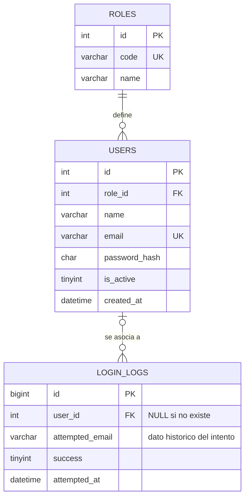

# Parte 2 — Base de datos

Registro histórico de la Parte 2. La importación posterior en XAMPP habitual
y el login real están documentados en [operations.md](operations.md).

La API usará MySQL/MariaDB mediante mysql2. Esta parte entrega el modelo, SQL,
cuentas ficticias y permisos; **todavía no implementa el endpoint de login**.

Los scripts se ejecutaron en una instancia temporal de **MariaDB 10.4.32**
con el binario de XAMPP, puerto 13306 y datos separados. No se modificó la base
habitual de XAMPP ni se abrió su puerto a la red.
MySQL 8.0.16+ se contempla en el diseño, pero no se ejecutó un servidor MySQL independiente.

## Árbol real de esta parte, antes del código

```text
proyecto-3-acceso-usuarios/
├── backend/
│   ├── database/
│   │   ├── schema.sql
│   │   ├── seed.sql
│   │   ├── create_app_user.sql
│   │   └── queries.sql
│   ├── .env
│   └── .env.example
├── docs/
│   └── database.md
├── .gitignore
├── README.md
└── CHANGELOG.md
```

Este es el subárbol de archivos implicados; el árbol completo está en README.md.
Las copias *.local.sql con contraseñas privadas nunca se versionan.

## 1. Reglas del modelo

1. Cada usuario tiene exactamente un rol; un rol puede tener varios usuarios.
2. El email identifica una cuenta y es único; no distingue mayúsculas.
3. Solo se almacena el hash bcrypt de la contraseña, nunca el texto plano.
4. Los usuarios inactivos siguen en la base, pero no podrán iniciar sesión.
5. Cada intento consultado por el futuro login genera un evento independiente.
6. Un intento con un email desconocido tiene user_id = NULL y success = 0.
7. El email del evento es una instantánea del identificador usado en ese intento:
   no se actualiza si la cuenta cambia de email.
8. No guardar contraseñas, hashes ni IPs dentro de login_logs.
9. Obtener el último acceso con MAX(attempted_at) filtrando success = 1, sin
   duplicar ese valor en users.
10. Todos los instantes se interpretan en UTC; la vista podrá mostrarlos en hora local.

Los rechazos por cuerpo inválido o rate limiting se resolverán en los middlewares
de la Parte 3 antes de consultar credenciales. Un error de conexión a MySQL no puede
garantizar que se guarde un evento en esa misma base.

## 2. Normalización paso a paso

La normalización se fundamenta en **dependencias funcionales**, no simplemente
en separar carpetas o agregar ids autoincrementales.

### Tabla sin normalizar: grupos repetidos

Ejemplo didáctico, no una tabla que debamos importar:

| user_id | name               | email           | password_hash | role_id | role_code | role_name     | attempts                               |
| ------- | ------------------ | --------------- | ------------- | ------- | --------- | ------------- | -------------------------------------- |
| 2       | Estudiante Demo    | student@np.test | H2            | 2       | student   | Estudiante    | [(1, 09:00, éxito), (2, 09:10, fallo)] |
| 1       | Administrador Demo | admin@np.test   | H1            | 1       | admin     | Administrador | [(1, 10:00, éxito)]                    |

H1 y H2 representan hashes, **no contraseñas**. Las fechas abreviadas y los intentos
son ejemplos para explicar el diseño; seed.sql no carga estos eventos.

Problemas:

- attempts contiene una lista de objetos: el valor no es atómico.
- Agregar un intento exige editar la lista de una cuenta.
- El nombre del rol se repetiría en todas las cuentas que lo comparten.
- Cambiar un rol en algunas filas y no en otras genera inconsistencias.

### Primera forma normal: un valor por celda

Convertimos cada intento en una fila; en este ejemplo, attempt_number es un
contador local a cada usuario, no un número global.

| user_id (PK parcial) | attempt_number (PK parcial) | name               | email           | password_hash | role_id | role_code | role_name     | attempted_at | success |
| -------------------- | --------------------------- | ------------------ | --------------- | ------------- | ------- | --------- | ------------- | ------------ | ------- |
| 2                    | 1                           | Estudiante Demo    | student@np.test | H2            | 2       | student   | Estudiante    | 09:00        | 1       |
| 2                    | 2                           | Estudiante Demo    | student@np.test | H2            | 2       | student   | Estudiante    | 09:10        | 0       |
| 1                    | 1                           | Administrador Demo | admin@np.test   | H1            | 1       | admin     | Administrador | 10:00        | 1       |

La clave de la tabla de ejemplo es (user_id, attempt_number). Todas las celdas son
atómicas, por lo que cumple 1FN.

**Todavía no cumple 2FN:** name, email, password_hash y los datos del rol dependen
solo de user_id, una parte de la clave compuesta.

### Segunda forma normal: eliminar dependencias parciales

Separamos los atributos del usuario de los atributos del intento.

**users_2fn**, PK user_id:

| user_id | name               | email           | password_hash | role_id | role_code | role_name     |
| ------- | ------------------ | --------------- | ------------- | ------- | --------- | ------------- |
| 2       | Estudiante Demo    | student@np.test | H2            | 2       | student   | Estudiante    |
| 1       | Administrador Demo | admin@np.test   | H1            | 1       | admin     | Administrador |

**attempts_2fn**, PK (user_id, attempt_number):

| user_id | attempt_number | attempted_at | success |
| ------- | -------------- | ------------ | ------- |
| 2       | 1              | 09:00        | 1       |
| 2       | 2              | 09:10        | 0       |
| 1       | 1              | 10:00        | 1       |

Dependencias:

- user_id → name, email, password_hash, role_id, role_code, role_name.
- (user_id, attempt_number) → attempted_at, success.

Cada atributo no clave depende de la clave completa de su tabla.
**Todavía hay dependencia transitiva:** user_id → role_id → role_code, role_name.

### Tercera forma normal: eliminar dependencias transitivas

El rol se convierte en una entidad independiente. En el diseño final, un id de
evento reemplaza al contador local, lo que permite registrar también intentos
de usuarios desconocidos sin inventar una cuenta ni una PK con NULL.

**roles**:

| id (PK) | code (UNIQUE) | name          |
| ------- | ------------- | ------------- |
| 1       | admin         | Administrador |
| 2       | student       | Estudiante    |

**users**, fragmento:

| id (PK) | role_id (FK) | name               | email (UNIQUE)  | password_hash | is_active |
| ------- | ------------ | ------------------ | --------------- | ------------- | --------- |
| 1       | 1            | Administrador Demo | admin@np.test   | H1            | 1         |
| 2       | 2            | Estudiante Demo    | student@np.test | H2            | 1         |

**login_logs**, ejemplo didáctico:

| id (PK) | user_id (FK opcional) | attempted_email | success | attempted_at |
| ------- | --------------------- | --------------- | ------- | ------------ |
| 1       | 2                     | student@np.test | 1       | 09:00        |
| 2       | 2                     | student@np.test | 0       | 09:10        |
| 3       | NULL                  | unknown@np.test | 0       | 09:20        |

Dependencias del modelo final:

- roles.id → roles.code, roles.name; code también es clave candidata.
- users.id → role_id, name, email, password_hash, is_active, created_at;
  email también es clave candidata.
- login_logs.id → user_id, attempted_email, success, attempted_at.

No se repiten code ni name del rol en users. El email histórico de un evento
no depende del email **actual** de users: una cuenta puede cambiar su identificador
sin reescribir el pasado. Por eso attempted_email es un atributo del evento, no
una copia mantenida de users.email.

created_at pertenece a la cuenta. last_login_at es un valor calculado, no una
columna duplicada. Así evitamos inconsistencia entre el resumen y los eventos.
Las tres tablas cumplen 1FN, 2FN y 3FN bajo estas reglas de negocio.

## 3. Diagrama entidad-relación



Un usuario puede tener cero o muchos intentos. Un intento corresponde a cero
o un usuario. users.role_id siempre apunta a un rol existente.

## 4. Archivos SQL entregados

### Diccionario de datos

| Tabla      | Columna         | Tipo SQL            | Regla                             |
| ---------- | --------------- | ------------------- | --------------------------------- |
| roles      | id              | INT UNSIGNED        | PK autoincremental                |
| roles      | code            | VARCHAR(32)         | Único; código estable del rol     |
| roles      | name            | VARCHAR(64)         | Nombre visible no vacío           |
| users      | id              | INT UNSIGNED        | PK autoincremental                |
| users      | role_id         | INT UNSIGNED        | FK obligatoria hacia roles        |
| users      | name            | VARCHAR(100)        | Obligatorio y no vacío            |
| users      | email           | VARCHAR(254)        | Único; identificador de acceso    |
| users      | password_hash   | CHAR(60), ascii_bin | Hash bcrypt, no texto plano       |
| users      | is_active       | TINYINT             | Solo 0/1; por defecto 1           |
| users      | created_at      | DATETIME(3)         | Fecha de creación en UTC          |
| login_logs | id              | BIGINT UNSIGNED     | PK autoincremental del evento     |
| login_logs | user_id         | INT UNSIGNED NULL   | FK; NULL si el usuario no existe  |
| login_logs | attempted_email | VARCHAR(254)        | Instantánea histórica obligatoria |
| login_logs | success         | TINYINT             | Solo 0/1; éxito requiere usuario  |
| login_logs | attempted_at    | DATETIME(3)         | Fecha del intento en UTC          |

Los ids de eventos BIGINT no se expondrán como números JavaScript sin comprobar
su rango; mysql2 podrá tratarlos como strings. No son props de la bienvenida.

### schema.sql

Crea la base np_user_access, las tres tablas InnoDB, PK, FK, índices, NOT NULL,
UNIQUE y nueve CHECK. Usa utf8mb4_unicode_ci para textos y ascii_bin para el hash.

- La FK roles → users restringe borrar roles utilizados.
- La FK users → login_logs restringe borrar cuentas con historial; se desactivan
  mediante is_active, en lugar de eliminar su auditoría.
- Los índices de login_logs facilitan buscar accesos por usuario y filtrar por fecha.
- El CHECK de email es básico, no un reemplazo de la validación del cliente/servidor.
- El CHECK del hash valida longitud y prefijo; bcrypt.compare realizará la verificación.

No contiene DROP DATABASE, TRUNCATE, REPLACE ni desactivación de constraints.
CREATE TABLE falla si la tabla ya existe para no ocultar diferencias de esquema.
CREATE DATABASE IF NOT EXISTS no migra una base previa ni cambia su collation.
Importar en un destino nuevo, no en una base ajena con el mismo nombre.

### seed.sql

Crea dos roles y tres cuentas ficticias dentro de una transacción:

| Email            | Contraseña de prueba | Rol     | Estado esperado                |
| ---------------- | -------------------- | ------- | ------------------------------ |
| admin@np.test    | AdminDemo!2026       | admin   | Podrá ingresar en la Parte 3   |
| student@np.test  | StudentDemo!2026     | student | Podrá ingresar en la Parte 3   |
| inactive@np.test | InactiveDemo!2026    | student | Acceso rechazado en la Parte 3 |

Las tres contraseñas ya tienen hashes bcrypt con salt independiente y coste **12**.
Los hashes se generaron y comprobaron con la dependencia bcrypt instalada.
El SQL no almacena contraseñas de usuario en texto plano. Las credenciales públicas
del README son solo datos de prueba: no reutilizarlas para servicios reales.

bcrypt procesa como máximo 72 bytes de contraseña. La validación de la Parte 3
deberá rechazar valores que excedan ese tamaño en UTF-8, no truncarlos silenciosamente.

login_logs empieza vacío: aún no hubo consultas de autenticación.
No reimportar el seed para reiniciar usuarios: un duplicado genera error.

### create_app_user.sql

Crea **np_login_app@127.0.0.1**, separada de root y de las cuentas del formulario.
Solo permite:

- SELECT de columnas de users necesarias para la autenticación.
- SELECT del rol.
- SELECT de user_id, success y attempted_at para calcular el último acceso.
- INSERT de eventos en login_logs.

No permite modificar cuentas, hashes o roles, borrar registros/tablas, leer
attempted_email del historial ni otorgar permisos a otros usuarios.
El rol admin del formulario **no convierte** esa cuenta en administrador de MySQL.

El script exige @APP_PASSWORD privado, de al menos 24 caracteres, en la misma
sesión SQL. Rechaza su ausencia y los placeholders de los ejemplos.
Usa un procedimiento administrativo temporal con SQL SECURITY INVOKER y después
lo elimina. CREATE USER se prepara con el literal escapado por QUOTE; esta es una
operación de instalación, no una consulta construida con datos de un formulario.
Las consultas del login seguirán usando mysql2.execute con parámetros.

Se recomienda una contraseña aleatoria hexadecimal: evita problemas de escape
con modos SQL diferentes, y no aparece en el repositorio.
Si la cuenta ya existe, el script falla: no la reutiliza ni cambia su contraseña.
Si falla tras crear la cuenta o conceder algún permiso, el alta puede quedar
parcial porque CREATE USER/GRANT no forman una transacción de aplicación.
Revisar como administrador antes de volver a ejecutar; nunca forzar un reset.

### queries.sql

Incluye ejemplos de INNER JOIN, LEFT JOIN, COUNT, SUM/CASE, GROUP BY, MAX, filtrado
por fecha y un SELECT parametrizado con PREPARE/EXECUTE. No selecciona hashes.
Las consultas del historial son para el administrador; no corresponden a un
endpoint público ni a todos los permisos de la cuenta de aplicación.

## 5. Importación con phpMyAdmin

### Crear tablas y cargar usuarios

1. Abrir el panel XAMPP e iniciar MySQL y Apache.
2. Entrar a http://localhost/phpmyadmin/ con una cuenta administrativa.
3. En Importar, seleccionar backend/database/schema.sql; charset utf8mb4/UTF-8.
4. Seleccionar np_user_access e importar backend/database/seed.sql.
5. Verificar: roles tiene 2 filas, users tiene 3 y login_logs tiene 0.
6. Opcionalmente ejecutar queries.sql para inspeccionar el modelo.

No se importaron estos scripts en tu instancia habitual: las pruebas usaron
una base aislada. Tampoco se configuró todavía la contraseña real en backend/.env.

### Preparar la cuenta privada

No usar una contraseña inventada por el README ni pegarla en el chat.
En PowerShell, para generar una contraseña aleatoria:

```powershell
node -e "console.log(require('node:crypto').randomBytes(24).toString('hex'))"
```

1. Guardar ese valor localmente en DB_PASSWORD de backend/.env.
2. Copiar create_app_user.sql a create_app_user.local.sql dentro de database/.
3. Agregar al inicio de la copia privada:

```sql
SET @APP_PASSWORD = 'PEGAR_AQUI_LA_CONTRASEÑA_PRIVADA_GENERADA';
```

4. Importar **la copia privada completa** en una única operación phpMyAdmin
   como administrador. Definir @APP_PASSWORD en otra pestaña o petición no sirve:
   la variable pertenece a una conexión y debe llegar junto con el script.
5. La contraseña SQL y DB_PASSWORD deben coincidir; DB_HOST debe ser 127.0.0.1.
6. Revisar el resultado y los permisos mediante:

```sql
SHOW GRANTS FOR 'np_login_app'@'127.0.0.1';
```

Este resultado es administrativo y puede incluir información de autenticación:
no compartirlo completo en capturas o en el repositorio.
La copia privada contiene un secreto: no subirla. .gitignore excluye *.local.sql.
Revisar git status antes de compartir cualquier archivo.
Si la instalación aplica una política adicional de contraseñas, generarla conforme
a esa política; no desactivarla.

### Comprobación de conexión

Ejecutar localmente; -p pide la contraseña SQL de forma interactiva:

```powershell
& "C:\xampp\mysql\bin\mysql.exe" --protocol=TCP --host=127.0.0.1 --port=3306 --user=np_login_app -p --database=np_user_access
```

Dentro del cliente:

```sql
SELECT users.id, users.name, users.email, roles.code AS role
FROM users
INNER JOIN roles ON roles.id = users.role_id;
```

No probar SELECT * en login_logs con esta cuenta: algunos de sus campos están
intencionalmente restringidos.
El backend de la Parte 3 usará esta cuenta, no root.
La app del celular habla con Express; nunca se conecta directamente a MySQL.

## 6. Validaciones realizadas

**38 comprobaciones correctas** sobre MariaDB 10.4.32, en un directorio de datos
temporal separado del XAMPP habitual:

- Tablas, InnoDB, collation, nueve CHECK y dos FK.
- Cantidades del seed y cuenta inactiva.
- Coste 12, contraseña válida e inválida de cada hash bcrypt.
- Provisionamiento sin secreto, placeholder y cuenta existente rechazados.
- Conexión mysql2 con la cuenta dedicada y permisos limitados.
- JOIN usuario/rol y parámetro de prueba de inyección SQL.
- UNIQUE de email, FK, NOT NULL y CHECK rechazando datos inválidos.
- INSERT de eventos conocidos/desconocidos y último acceso solo exitoso.
- Prohibición de modificar usuarios/hashes/roles o eliminar tablas/eventos.
- Restricción de lectura del identificador histórico.
- Consultas de ejemplo y seed sin sobrescribir cuentas existentes.
- Los eventos de prueba se revierten: la base validada queda sin intentos ficticios.

No se ejecutó login HTTP, no se probó aún el acceso desde Expo Go y no se afirma
que todos los requisitos de la entrega estén cumplidos.
CREATE/GRANT/DROP pueden provocar commits implícitos: las pruebas de permisos DDL
se hicieron fuera de las transacciones que agregaban eventos.

## 7. Preguntas para defender esta parte

**¿Por qué hay una tabla de roles?**
Para que el código y nombre del rol se definan una vez, evitando la dependencia
transitiva user_id → role_id → datos del rol.

**¿Agregar un id hace que una tabla esté en 3FN?**
No. Hay que analizar las dependencias funcionales y eliminar las parciales y
transitivas que correspondan al modelo.

**¿Qué pasa si el email no existe?**
El evento se registra con user_id NULL y success 0. La API responderá el mismo
mensaje que para una contraseña incorrecta, para evitar enumeración.

**¿Por qué guardamos el email del intento?**
Es una instantánea histórica del identificador usado; no depende del email
actual de la cuenta y permite registrar intentos de cuentas desconocidas.

**¿Hash significa cifrado?**
No. El hash no se descifra. bcrypt usa salt y coste; bcrypt.compare verifica
una contraseña candidata frente al hash almacenado.

**¿Las credenciales del seed son las de MySQL?**
No. admin@np.test es un usuario del formulario. np_login_app es una cuenta SQL
distinta, con un secreto privado y permisos limitados.

**¿Por qué no usa root el backend?**
Un error o una inyección no debería otorgar control administrativo de toda
la base. La aplicación solo recibe permisos necesarios para leer cuentas y loguear intentos.

**¿Por qué MAX y no una columna de último acceso?**
El evento exitoso ya tiene la fecha. Calcularla evita mantener dos valores
que podrían discrepar.

**¿Los CHECK sustituyen las validaciones de la API?**
No. Protegen la integridad de los datos, pero el cliente y el servidor siguen
validando formato, tamaños y credenciales con mensajes adecuados.

## ¿Qué rúbrica cubre esto?

- [x] Modelo relacional users, roles y login_logs.
- [x] Explicación con tablas de 1FN, 2FN y 3FN.
- [x] Diagrama entidad-relación Mermaid.
- [x] SQL con PK, FK, índices, NOT NULL, UNIQUE, CHECK, utf8mb4 e InnoDB.
- [x] Seed con bcrypt y credenciales ficticias documentadas.
- [x] Cuenta SQL dedicada, localhost por IP y menor privilegio.
- [x] Sin secretos reales en scripts públicos; plantillas/copia privada documentadas.
- [x] Consultas de ejemplo y verificaciones reales en MariaDB.
- [ ] Importación en XAMPP habitual y contraseña privada: pasos de preparación pendientes.
- [ ] API y comparación HTTP de credenciales: Parte 3.

## Fuentes oficiales

- [Normalización](https://learn.microsoft.com/en-us/troubleshoot/microsoft-365-apps/access/database-normalization-description)
- [CREATE TABLE MariaDB](https://mariadb.com/docs/server/server-usage/tables/create-table)
- [Constraints MariaDB](https://mariadb.com/docs/server/reference/sql-statements/data-definition/constraint)
- [CHECK MySQL](https://dev.mysql.com/doc/refman/8.0/en/create-table-check-constraints.html)
- [GRANT MariaDB](https://mariadb.com/docs/server/reference/sql-statements/account-management-sql-statements/grant)
- [CREATE USER MySQL](https://dev.mysql.com/doc/refman/8.0/en/create-user.html)
- [bcrypt](https://github.com/kelektiv/node.bcrypt.js)
