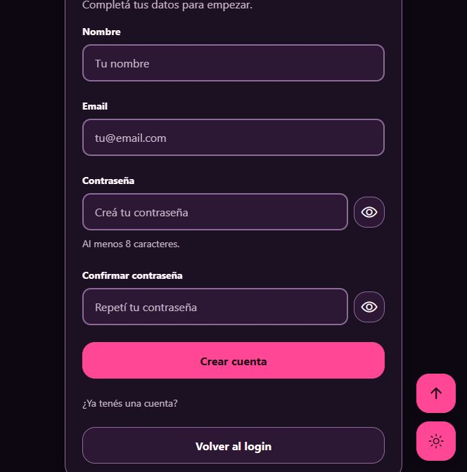

# Registro de cuentas — Frontend 0.6.0 / API 0.4.0

Ampliación solicitada por el usuario después de las seis partes originales.
Se mantiene Expo SDK 57, TypeScript estricto, Atomic Design y diseño violeta/rosa.

## Recorrido

1. Login: **¿No tenés una cuenta? → Crear cuenta**.
2. Registro: nombre, email, contraseña y confirmación.
3. El formulario comprueba campos y coincidencia antes de enviar.
4. La API crea la cuenta en SQL, con hash bcrypt de coste 12.
5. Se muestra confirmación; **Ir al login** permite ingresar con la cuenta nueva.

No se simula una creación con AsyncStorage. No se inicia sesión automáticamente:
el primer acceso se registra al comparar las credenciales en el login.
Nombre/email se recortan; email se normaliza. La contraseña no se recorta.
La confirmación se usa solo en el dispositivo y no se envía al servidor.

## Archivos y responsabilidades

- app/register.tsx: ruta fina, navegación y redirección si ya hay usuario en memoria.
- RegisterPage: presentación; recibe onLogin mediante props tipadas.
- RegistrationForm: campos, foco, visibilidad, spinner, bloqueo y confirmación.
- useRegistrationForm: validación, envío y cancelación al desmontar.
- authService: transporte común con login, timeout y JSON desconocido validado.
- validateRegistration: middleware de servidor; rechaza campos extra y querystrings.
- createUser: INSERT parametrizado, rol student impuesto por servidor.
- FormNotice: mensaje accesible compartido con login.

## API

POST /api/auth/register acepta solamente name, email y password.

| Estado | Resultado                                                                 |
| ------ | ------------------------------------------------------------------------- |
| 201    | Cuenta creada; devuelve success/message, sin contraseña, hash ni usuario. |
| 400    | Datos inválidos, campos adicionales, querystring o JSON malformado.       |
| 409    | Email existente; la cuenta existente no se cambia ni reactiva.            |
| 415    | Cuerpo que no es application/json.                                        |
| 429    | Límite independiente de 5 solicitudes/IP cada 15 minutos.                 |
| 500    | Fallo genérico; no expone SQL ni configuración.                           |

El índice UNIQUE del email resuelve también solicitudes simultáneas.
No aceptar role, role_id, is_active, id ni created_at del cliente.
El servidor asigna student; SQL aporta estado activo y fecha por defecto.
No se ofrecen recuperación, verificación de email, JWT ni sesión persistente.
El 409 revela que un email existe: es una decisión explícita de UX para esta demo,
no una política de privacidad lista para producción.

## Permisos de SQL

Una instalación nueva usa create_app_user.sql actualizado.
Una existente ejecuta backend/database/enable_registration.sql como administrador.
En esta PC ya se aplicó solo INSERT (role_id, name, email, password_hash) a users.
No se cambiaron contraseñas ni datos existentes; UPDATE/DELETE siguen prohibidos.
La cuenta puede escribir esas cuatro columnas, pero no is_active, id o created_at.
El rol de registro lo fija la consulta del servidor, no un permiso SQL por valor.

## Evidencia y límites

- 39 comprobaciones HTTP/SQL/configuración con una base/cuenta temporal separada:
  hashes, duplicados, concurrencia, permisos, validación, límite y fallos.
- 22 comprobaciones de validación/servicio frontend para registro.
- 53 regresiones anteriores del servicio de login, JSON, timeout y utilidades.
- Web real contra XAMPP habitual: crear cuenta ficticia, confirmar, ingresar y salir.
- Errores de campos vacíos y confirmación distinta; bloqueo con spinner observado.
- Tema claro/oscuro y controles flotantes comprobados en el navegador.
- Capturas nuevas a tamaño efectivo 664×672; el override del navegador no cambió
  dimensiones. No se presentan como capturas de 390/1440 ni pruebas nativas.
- Usuario confirmó login previo en iPhone. Registro nuevo en iPhone aún pendiente.

Las bases/cuentas temporales de pruebas se eliminaron al terminar. La cuenta
ficticia de la prueba web permanece solo en la base local; no forma parte del seed.
No hay suite permanente ni npm test; los scripts de verificación están fuera de Git.

[Registro claro](screenshots/registro-claro.png) ·
[Cuenta creada](screenshots/cuenta-creada.png).
